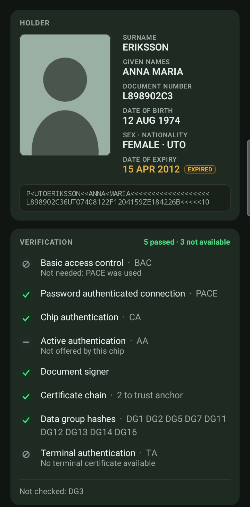
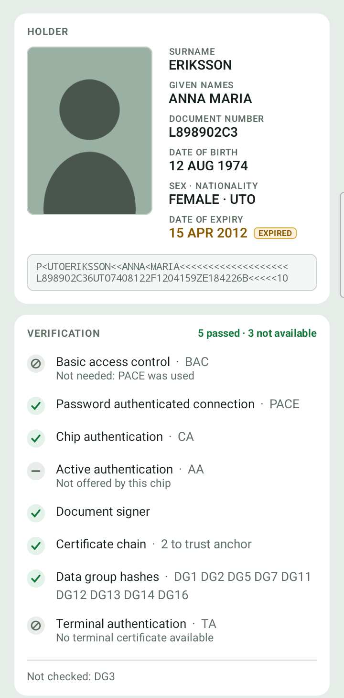
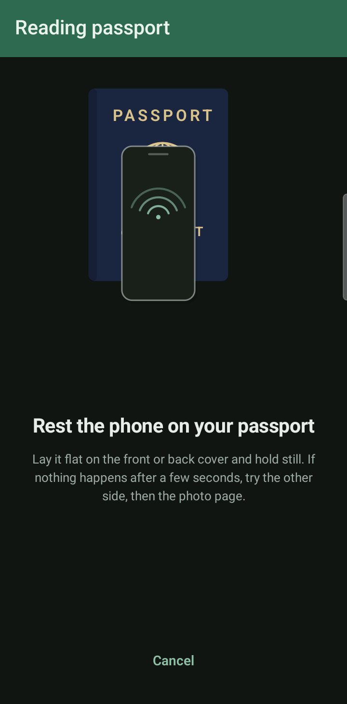

# Android NFC Passport Reader

An Android library that reads the contactless chip in an ePassport and tells
you what can be trusted about it, with a sample app that shows it working.

<p align="center">
  
  
  
</p>

<p align="center"><sub>The sample app on the ICAO 9303 specimen document; no real passport data.</sub></p>

## What it does

- **Reads ICAO 9303 passports (TD3)** over NFC, authenticating with **PACE** or
  **BAC** from the three MRZ fields (document number, date of birth, expiry).
- **Reads the data groups** the chip lists: the MRZ (DG1), the face (DG2, in
  JPEG or JPEG 2000, ISO/IEC 19794 or 39794), and where present the portrait,
  signature, personal and document details, and persons to notify (DG5, DG7,
  DG11, DG12, DG13, DG16).
- **Verifies what it read**, check by check: the document signer's signature,
  the certificate chain to a country's CSCA, the hash of every data group it
  read, and whether the chip is genuine (Chip Authentication, PACE-CAM or
  Active Authentication). Each check is reported as passed, failed, not
  present or not checked, and each data group's hash says whether it was
  compared.
- **Copes with real hardware**: ReaderMode handling, adaptive settle delays,
  PACE retries decided by status word, and chip-gated extended-length APDUs,
  all tunable through one timing config.
- **Ships CSCA trust anchors** from the German BSI master list, with a script to
  refresh them.
- **Logs personal data only in debuggable builds**: MRZ fields, names and
  document numbers go through a gate tied to the host app's debuggable flag.
  It also keeps every third-party type off its public API.

The sample app adds camera MRZ scanning (ML Kit), manual entry, a reading
screen showing where to hold the phone, and a result screen with one panel per
data group.

## Modules

| Module | What it is |
|---|---|
| `:passport-reader` | Android library. Chip protocols, data model, verification report, and the NFC reliability layer. No DI, no UI, no analytics. |
| `:sample-app` | Small Compose app demonstrating the library. Camera MRZ scan or manual entry, read, result. |

## Using the library

The library is on Maven Central, for apps with `minSdk` 29 or higher:

```kotlin
dependencies {
    implementation("io.github.munkchunk:passport-reader:0.1.0")
}

android {
    // BouncyCastle's three jars each carry the same licence file.
    packaging {
        resources {
            pickFirsts += "META-INF/LICENSE.md"
        }
    }
}
```

The library carries its own R8 rules, so a minified app needs nothing more.

Two levels of API, depending on how much you want to own.

**The whole flow**, including ReaderMode and retries:

```kotlin
val manager = NfcPassportReaderManager(context)

// From your Activity's lifecycle
override fun onResume() { super.onResume(); manager.attachActivity(this) }
override fun onPause()  { super.onPause();  manager.detachActivity() }

// Observe progress
manager.readState.collect { state -> /* NfcReadState */ }

// Read. Dates are the raw 6-digit MRZ form, YYMMDD.
val passport = manager.readPassport(
    passportNumber = "L898902C<",
    dateOfBirth    = "740812",
    expiryDate     = "120415"
)
```

**A single read**, if you already have the `Tag`:

```kotlin
val reader = NfcPassportReader(context)
val result: Result<Passport> = reader.readPassport(tag, passportNumber, dateOfBirth, expiryDate)
```

Failures arrive as `PassportReadException` subtypes — `WrongMrz`,
`AuthenticationFailed`, `PaceFailed`, `TagLost`, `NfcIo`, `NoTagDetected`,
`TrustOrPassiveAuthFailed`, `Unknown`.

Each carries `titleRes` and `messageRes` — string resource ids — plus
`messageArgs` and a plain-text `technicalDetails` for a bug report:

```kotlin
val text = context.getString(error.messageRes, *error.messageArgs.toTypedArray())
```

The wording lives in this library's `res/values/strings.xml`, so it can be read
in one place and **overridden by declaring the same name in your own
`strings.xml`**. An app that would rather write its own wording can ignore the
resources entirely and switch on the exception type. `technicalDetails` stays a
String on purpose: status words and PACE steps are diagnostics, not copy, and
are easier to search for untranslated.

### Timing

Real-world reads live or die on RF timing, so it is configurable:

```kotlin
NfcPassportReaderManager(context, timingConfig = NfcTimingPresets.CONSERVATIVE)
```

`DEFAULT` is tuned for PACE passports. `CONSERVATIVE` raises the settle delays
for flaky hardware or stubborn documents. `FAST` is quicker but will likely fail
on PACE. The manager also adapts at runtime, lengthening the settle delay after
a lost tag and shortening it again after a success.

`NfcReadTimingConfig` covers the whole read, not just the part before the tag is
detected: `awaitTagTimeoutMs` and the settle delays govern tag detection, while
`isoDepTimeoutMs`, `cardStabilizationMs` and the `pace*` values govern what
happens once the chip is in hand. Every delay in the library comes from here.

Setting `awaitTagTimeoutMs` to `Long.MAX_VALUE` removes the limit on waiting for
a passport, and the sample app does this (see
[docs/sample-app.md](docs/sample-app.md#waiting-for-a-passport)). The wait then ends only
when the read is cancelled, so cancel it when the Activity pauses and when NFC
is switched off (`NfcAdapter.ACTION_ADAPTER_STATE_CHANGED`): a wait left running
holds the manager's read lock, and every later read queues behind it.

### Trust anchors

Passive authentication checks the document signer against CSCA certificates
bundled with the library, taken from the German BSI master list (see
[NOTICE.md](NOTICE.md)). An app can add its own: put them in a PKCS12 key
store named `csca-certificates.p12`, with an empty password, in the app's
external files `Download` directory
(`context.getExternalFilesDir(Environment.DIRECTORY_DOWNLOADS)`). Each
certificate there is used as a trust anchor alongside the bundled ones, which
is how a country missing from the master list can be added.

### Error reporting

Optional, and an interface rather than a dependency:

```kotlin
NfcPassportReaderManager(context, errorReporter = object : NfcErrorReporter {
    override fun report(where: String, ex: PassportReadException) { /* ... */ }
})
```

## Building

Needs JDK 17 and the Android SDK (API 36). Point Gradle at your SDK:

```
echo "sdk.dir=/path/to/android-sdk" > local.properties
```

```bash
./gradlew :passport-reader:assembleDebug
./gradlew :sample-app:assembleDebug
./gradlew :passport-reader:testDebugUnitTest :sample-app:testDebugUnitTest
```

[CONTRIBUTING.md](CONTRIBUTING.md) has the full set of checks.

## Verifying it works

**An emulator cannot do this.** You need an NFC-capable Android phone and a real
ePassport. Install the sample app from the APK on the
[Releases page](https://github.com/munkchunk/android-nfc-passport-reader/releases),
or build it with `./gradlew :sample-app:installDebug`, then enter or scan the
passport's details and hold it against the back of the phone.
[docs/testing.md](docs/testing.md) has the log tags to watch, what a good read
looks like, and what to check first when one fails.

## Limitations

- **TD3 passports only.** No TD1 or TD2 identity cards.
- **Six countries have no trust anchor** in the bundled CSCA list — `GH`, `ID`,
  `IR`, `KZ`, `NG`, `YE` — so their passports will fail passive authentication.
  See [NOTICE.md](NOTICE.md).
- **Most data groups have never been read from a real passport.** DG4 (iris)
  is not read at all, nor is DG3 (fingerprints): both need Terminal
  Authentication, which the public API cannot be given credentials for yet.
  PACE-CAM is verified only against ICAO's worked example. See
  [docs/data-groups.md](docs/data-groups.md) for every file the chip can hold
  and what the library does with it.
- **The chip read path has no automated tests.** Verifying a change means a
  phone and a real passport.

The full list is in [docs/architecture.md](docs/architecture.md#known-limitations).

## Documentation

- [docs/architecture.md](docs/architecture.md): how a read and its
  verification work, and how the code is laid out.
- [docs/design-notes.md](docs/design-notes.md): the design decisions, and the
  reason for each.
- [docs/data-groups.md](docs/data-groups.md): what the library reads from the
  chip, what it returns, and which paths a real passport has exercised.
- [docs/sample-app.md](docs/sample-app.md): the sample app's screens, MRZ
  scanning and accessibility.
- [docs/testing.md](docs/testing.md): the automated tests, and testing on a
  phone with a real passport.
- [docs/releasing.md](docs/releasing.md): how a version is published to Maven
  Central and the sample app signed and released.
- [NOTICE.md](NOTICE.md): third-party code and licences.

## Contributing

Reports of what your passport did, especially from countries the library has
not seen, are as valuable as code. See [CONTRIBUTING.md](CONTRIBUTING.md). To
report a vulnerability, see [SECURITY.md](SECURITY.md).

## Licence

Apache License 2.0 — see [LICENSE](LICENSE). Free to use, modify and
redistribute, commercially or otherwise, by individuals and organisations
alike.

One thing to be aware of if you ship an app built on this library. The library
links against JMRTD, SCUBA and cert-cvc, which are LGPL. Nothing of theirs is
modified, vendored or re-exported here — they are `implementation` dependencies
and no third-party type appears on this library's public API — so this
project's own Apache-2.0 terms are unaffected. But the LGPL obligations travel
with the *combined work* you distribute: preserve their notices, make their
licences available, and allow your recipients to relink against a modified
JMRTD. [NOTICE.md](NOTICE.md) records every dependency and its licence.
