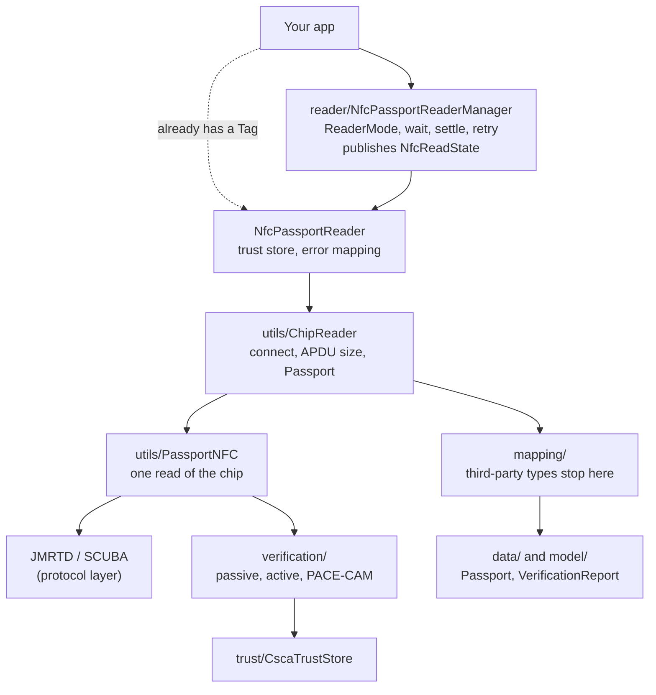

# Architecture

How the library reads and verifies a passport chip, and how the code is laid
out.

The rest of the documentation:

| Document | Covers |
|---|---|
| [design-notes.md](design-notes.md) | The library's design decisions, and why each is the way it is |
| [data-groups.md](data-groups.md) | What is read from the chip, group by group |
| [sample-app.md](sample-app.md) | The sample app: its structure, result screen, MRZ scanning and accessibility |
| [testing.md](testing.md) | What the unit tests cover, and how to test on a phone with a real passport |
| [CONTRIBUTING.md](../CONTRIBUTING.md) | Building, the checks, and the house rules |

## Overview

An ICAO 9303 ePassport has a contactless chip holding the holder's details,
face image and other data in numbered files called data groups (DG1, DG2,
...), plus a signed security object, EF.SOd, carrying a hash of each one. A
read has three jobs:

1. **Get access.** The chip will not talk without proof that the reader has
   seen the printed page. Both access protocols, BAC and PACE, derive their key
   from three fields of the machine readable zone (MRZ): document number, date
   of birth and expiry date.
2. **Read the files** over an encrypted, authenticated channel (secure
   messaging).
3. **Verify** what was read: that EF.SOd was signed by a document signer that
   chains to a country's CSCA certificate, that every data group read hashes to
   the value EF.SOd holds, and, where the chip supports it, that the chip itself
   is genuine rather than a copy.

Verification is reported, never assumed. A read returns a `Passport` with
everything it got and a `VerificationReport` saying what held, what failed,
and what could not be checked. Deciding whether that is *good enough* is the
application's call, not the library's.

## Modules

| Module | What it is |
|---|---|
| `:passport-reader` | Android library: chip protocols, data model, verification, and the NFC reliability layer. No DI, no UI, no analytics. |
| `:sample-app` | Compose app showing the library in use: camera MRZ scan or manual entry, the read, and a result screen. |

The library's main dependencies are JMRTD, SCUBA and cert-cvc for the chip
protocols, BouncyCastle for cryptography, OpenJPEG (through jp2-android) for
JPEG 2000 images, and JNBIS for WSQ fingerprints. All are `implementation` dependencies: none of their types appears on
the public API. See [NOTICE.md](../NOTICE.md) for licences.

## The library at a glance

| Package | Holds |
|---|---|
| (root) | `NfcPassportReader`: read a chip from a `Tag` you already have |
| `reader/` | `NfcPassportReaderManager` (the whole flow), `NfcReadState` and `ReadStage`, adaptive settle timing, per-instance tag hand-off |
| `timing/` | `NfcReadTimingConfig` and `NfcTimingPresets`: every delay in the library |
| `data/` | `Passport` and the details it carries |
| `model/` | `VerificationReport`, `CheckResult`, `DataGroupHash`, `CertificateDetails`, `DocumentFeatures`, `FaceDetails`, the error types |
| `verification/` | Passive Authentication, Active Authentication, PACE-CAM's chip proof, and the signature and chain checks they share |
| `trust/` | `CscaTrustStore` and the loader for the bundled CSCA certificates |
| `crypto/` | The BouncyCastle provider every `getInstance` call is given |
| `mapping/` | Conversion from JMRTD, SCUBA and X.509 types into the library's own |
| `utils/` | The chip read itself, and the pure decisions around it (which chip-authentication key to try, which terminal credentials, when PACE retries) |

Public API lives in `data/`, `model/`, `reader/`, `timing/` and `trust/`, plus
`NfcPassportReader`. Everything else is `internal`. The API is recorded in
`passport-reader/api/passport-reader.api`, and `apiCheck` (part of `check`
and `tools/checks.sh`) fails when it changes (see
[design-notes.md](design-notes.md#public-api)).

## A read, step by step

`NfcPassportReaderManager.readPassport()` runs the whole flow. Progress is
published as `NfcReadState` on a `StateFlow`; while the chip is being read,
`NfcReadState.Reading` carries a `ReadStage` reported as each stage starts,
never estimated.

**1. Wait for the passport.** The manager resets ReaderMode for a clean RF
field, enables it, and waits for a tag. The platform can silently drop a
ReaderMode registration when it re-applies NFC routing, so the registration is
re-asserted on a schedule (`readerModeReassertDelaysMs`) while waiting.

**2. Settle.** After detection the manager waits before the first command, so
the field stabilises. The delay adapts: it grows after a tag is lost early and
shrinks after a success (`NfcAdaptiveTiming`). If the passport slips off and
back during the settle, Android issues a new `Tag` and refuses I/O on the old
one, so the read uses the newest tag delivered while settling.

**3. Connect and probe** (`ReadStage.Connecting`). `ChipReader` connects
`IsoDep` with a long timeout, then reads EF.CardAccess, which needs no
authentication. Whether the chip answers with the file decides, together
with the phone's support, whether to use extended-length APDUs (4 KB blocks
rather than 223 bytes). After a stabilisation delay, EF.CardAccess is read
again for its PACEInfos.

**4. Authenticate** (`ReadStage.Authenticating`). With PACEInfos, PACE is
tried with each offered variant in turn, retrying a
variant only when the failure's status word says a retry could help
(`PaceRetry`). Without them, BAC. For PACE-CAM, EF.CardSecurity is read at this
point, since it lives outside the passport application.

**5. Read the small files** (`ReadStage.ReadingData`). EF.SOd first: it is the
signed list of which data groups exist. Then DG1 (the MRZ), DG14
(chip-authentication keys) and EF.CVCA, which are asked for whether or not
EF.SOd lists them. Chip Authentication runs here when DG14 offers it,
replacing the session keys with ones only a genuine chip can derive. Terminal
Authentication would run here too, but needs an issuing state's inspection
credentials, and the public API has no way to supply them yet. DG15 (the
Active Authentication key) is read when EF.SOd lists it.

**6. Read the face** (`ReadStage.ReadingPhoto`). DG2 is most of the bytes and
most of the wait. Then the optional groups EF.SOd lists: DG5, DG7, DG11, DG12,
DG13 and DG16. A failure in any of these is logged and does not fail the read.
DG3 would be read only after Terminal Authentication had succeeded, so in
practice it is not read; DG4 is never read.

**7. Verify** (`ReadStage.Verifying`). See [Verification](#verification).

**8. Build the result.** `ChipReader` decodes the images and maps everything
through `mapping/` into a `Passport`. The manager disables ReaderMode on
success. On failure it leaves ReaderMode on, so the user can retry without a
button press.

How long each stage takes is in
[design-notes.md](design-notes.md#where-the-time-goes).

## Verification

Chip and Terminal Authentication run during the read, in step 5. Everything
else runs after the files are read, in `PassportNFC.verifySecurity()`:
Passive Authentication, the EF.CardAccess check, PACE-CAM's chip proof and
Active Authentication. All of it lands in a `VerificationReport`. Each check
is a `CheckResult`: a `CheckVerdict` (`SUCCEEDED`, `FAILED`, `NOT_PRESENT`,
`NOT_CHECKED`, `UNKNOWN`) and a reason. A check is null when the read never
reached it. `pace` is also null when PACE was not used and no signed DG14
lists it.

| Report field | Check | Where |
|---|---|---|
| `basicAccessControl` / `pace` | Which access protocol ran and whether it completed. `pace` is then held to DG14's signed PACE list whichever protocol ran, and fails if EF.CardAccess hid PACE | `PassportNFC`, `utils/CardAccessCheck` |
| `documentSignature` | EF.SOd's signature verifies against the document signer certificate | `verification/PassiveAuthentication` |
| `certificateChain` | The document signer chains to a trusted CSCA | `verification/PassiveAuthentication` |
| `dataGroupHashes` | Every data group read hashes to EF.SOd's value | `verification/PassiveAuthentication` |
| `chipAuthentication` | Chip Authentication, or PACE-CAM's chip proof checked against EF.CardSecurity; `NOT_PRESENT` when the chip offers neither | `PassportNFC`, `verification/ChipAuthenticationMapping` |
| `activeAuthentication` | Active Authentication: the chip signs a fresh challenge with DG15's key | `verification/ActiveAuthentication` |
| `terminalAuthentication` | Terminal Authentication (not reachable through the public API yet) | `PassportNFC` |

The report also carries `hashes`, one `DataGroupHash` per group EF.SOd lists,
and `chainCertificates`, the chain `certificateChain` checked: document signer
first and CSCA last, or the document signer alone when no chain to a trusted
CSCA could be built.

**Passive Authentication** is written from ICAO 9303-11 and parses EF.SOd with
BouncyCastle, not JMRTD. It hashes the bytes exactly as the chip sent them: a
parsed file re-encoded is not guaranteed to be byte-identical. JMRTD caches
every file it has read for the life of the session, so verification asks for
each group again at no extra cost over the air.

**EF.CardAccess is unsigned**, so a cloned chip could hide PACE in it and
force the weaker BAC. ICAO 9303-11 §4.2 requires holding it to the signed list
in DG14, which is why the check applies to BAC sessions too. That check uses
DG14 exactly as Passive Authentication hashed it, and only when EF.SOd's
signature and chain held.

**`dataGroupHashes` passing does not mean every listed group was compared.**
DG3 and DG4 are never requested without Terminal Authentication, and an
optional group the chip refuses is recorded without a computed hash rather
than failed. A `DataGroupHash` whose `compared` is false was not checked; the
sample app lists those as "Not checked".

**A refused EF.CardSecurity after PACE-CAM is `NOT_CHECKED`**, not `FAILED`: a
genuine chip's quirk must not read as a clone.

### Trust anchors

`CscaTrustStore` holds the CSCA certificates passive authentication chains to.
The library bundles the German BSI master list, split into self-signed roots
(anchors) and link certificates (used for path building only), and loads it
in the background when `NfcPassportReader` is created. An app can add its own
certificates; see the README. `tools/update-csca-masterlist.sh` refreshes the
bundle. It checks the master list's CMS signature against the signer
certificate the list itself carries, which proves integrity but not origin:
the signer is not chained to a BSI root, so authenticity rests on the HTTPS
download and on checking the printed signer. Six countries have no
anchor in the BSI list; see [NOTICE.md](../NOTICE.md).

Certificates are checked for validity today, not at the document's signing
time, so a passport whose document signer certificate has since expired fails
the chain check.

## Errors

Every failure reaches the caller as a `PassportReadException` subtype:

| Type | Means |
|---|---|
| `WrongMrz` | The chip refused the MRZ-derived key |
| `AuthenticationFailed` | Access was refused for another reason, such as a blocked PACE password |
| `PaceFailed` | PACE could not be completed, or a variant failed in a way that stops further tries |
| `TagLost` | The passport left the field |
| `NfcIo` | A transport or chip fault mid-read |
| `NoTagDetected` | No passport arrived before `awaitTagTimeoutMs` |
| `TrustOrPassiveAuthFailed` | A cryptographic error (`GeneralSecurityException`) stopped the read. Failed checks are not errors: they are verdicts in the report |
| `Unknown` | Anything else, with its cause |

`model/error/JmrtdErrorMapper` makes the classification. It decides on the
status word, which SCUBA copies up through every wrapper, and on JMRTD's
protocol step. The one use of message text is Android's "Tag ... is out of
date", which is the only thing that tells a superseded tag from another
`SecurityException`.

Each exception carries `titleRes` and `messageRes` (string resources the app
can override by name), `messageArgs`, and a plain-text `technicalDetails` for
bug reports. Error copy lives in string resources, not Kotlin, so an app can
reword or translate it without touching the library. Two things are deliberately plain
English strings instead: `technicalDetails`, and the `CheckResult` reasons in
the report, which are diagnostics apps may show but are not localised.

## Known limitations

- TD3 passports only; no TD1 or TD2 identity cards.
- Six countries (GH, ID, IR, KZ, NG, YE) have no CSCA anchor in the bundled
  list.
- Certificates are checked for validity now, not at signing time.
- `dataGroupHashes` can pass with groups uncompared (DG3, DG4, refused
  optional groups); check each `DataGroupHash`.
- Never exercised on a real chip: Terminal Authentication, PACE-CAM, Active
  Authentication, ISO/IEC 39794 biometrics, and DG5, DG7, DG11, DG12, DG13 and
  DG16. Each is known from the specification, worked examples and tests.
- A PACE-CAM chip whose DG14 lists no PACEInfos is not checked against
  EF.CardSecurity, although ICAO 9303-11 §4.2 allows it.
- Terminal Authentication cannot be used through the public API: the trust
  store a read uses is built inside `NfcPassportReader`, and nothing lets an
  app add inspection-system credentials to it. When it is opened up, it will
  also need a way to sign remotely, since credentials are currently a
  `PrivateKey` in a `KeyStore`.
- `NfcPassportReaderManager` and `NfcAdaptiveTiming` log through Timber
  directly rather than `NfcLog`, bypassing its personal-data gate. They log
  state, timing and each failure's `technicalDetails`.
- `NfcPassportReader` owns a `CoroutineScope` with no `close()`.
- "Could not find the chip" cannot distinguish a passport never seen from one
  seen and lost before the app was told.
